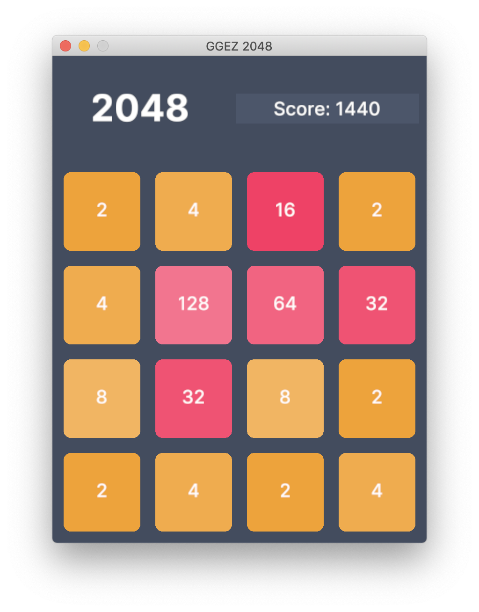

# GGEZ 2048

Classic 2048 game clone, written in Rust with GGEZ game engine.

## Screenshots



## Download

Please see [release section](https://github.com/ngobach/ggez-2048/releases) for precompiled binaries.

## Build

First you need rust and cargo installed. The quickest way is using [**rustup**](https://rustup.rs/).

To build the project run the following command in this project root directory

```shell
cargo build --release
```

Then run it with

```shell
./target/release/ggez-2048
```

## Links

- [GGEZ](https://ggez.rs/)

## License

```
MIT
```
